# Adding Transaction Fees to Antigravity Chain

## Why Transaction Fees?

Your codebase already has TODOs for this ([Constants.ts:10](file:///d:/Projects/blockchain/src/Constants.ts#L10), [Blockchain.ts:258](file:///d:/Projects/blockchain/src/Blockchain.ts#L258), [Mempool.ts:6](file:///d:/Projects/blockchain/src/Mempool.ts#L6)). Transaction fees solve three critical problems:

| Problem | How Fees Help |
|---|---|
| **Spam / DoS** | A minimum fee makes flooding the mempool expensive |
| **Miner Incentive** | As block rewards halve (every 100 blocks), fees become the primary miner income |
| **Prioritization** | Higher-fee transactions get mined first, creating a fair market for block space |

---

## Overview of Changes

Every file touched, at a glance:

```mermaid
graph TD
    A["Transaction.ts"] -->|"+ fee field, hash, validation"| B["ChainValidator.ts"]
    A -->|"+ fee in constructor & fromObject"| C["Blockchain.ts"]
    B -->|"validate fee, route fee to miner"| C
    C -->|"deduct fee from sender, fee-aware balance check"| D["Mempool.ts"]
    D -->|"sort by fee (priority queue)"| E["server.ts"]
    E -->|"accept fee in API"| F["Constants.ts"]
    F -->|"MIN_TRANSACTION_FEE"| A

    E -->|"expose minTransactionFee"| G["useBlockchain.ts"]
    G -->|"fee in interface, hash, signing"| H["TransactionForm.tsx"]
    G -->|"fee hydration in fetchData"| I["TransactionModal.tsx"]
    G -->|"fee display"| J["Mempool.tsx"]
    G -->|"fee display"| K["BlockModal.tsx"]
    G -->|"fee annotation"| L["ActivityList.tsx"]
    G -->|"pending fees total"| M["MiningCard.tsx"]

    style G fill:#1e3a5f,stroke:#6366f1
    style H fill:#1e3a5f,stroke:#a855f7
    style I fill:#1e3a5f,stroke:#a855f7
    style J fill:#1e3a5f,stroke:#a855f7
    style K fill:#1e3a5f,stroke:#a855f7
    style L fill:#1e3a5f,stroke:#a855f7
    style M fill:#1e3a5f,stroke:#a855f7
```



---

## Phase 1 — Data Model: `Transaction.ts`

Add a `fee` property to the `Transaction` class. The fee is denominated in **atomic units** (like everything else) and is included in the transaction hash so it can't be tampered with.

```diff
 export class Transaction {
   public fromAddress: string | null;
   public toAddress: string;
   public amount: number;
+  public fee: number;
   public timestamp: number;
   public nonce: number;
   public signature: string;

-  constructor(fromAddress: string | null, toAddress: string, amount: number, nonce: number = 0) {
+  constructor(fromAddress: string | null, toAddress: string, amount: number, nonce: number = 0, fee: number) {
     this.fromAddress = fromAddress;
     this.toAddress = toAddress;
     this.amount = amount;
+    this.fee = fee;
     this.timestamp = Date.now();
     this.nonce = nonce;
     this.signature = '';
   }
```

### Hash must include the fee

This is **critical** — if the fee isn't part of the hash, a miner could modify it after the sender signs.

```diff
   public calculateHash(): string {
     return crypto
       .createHash('sha256')
-      .update(`${this.fromAddress}|${this.toAddress}|${this.amount}|${this.timestamp}|${this.nonce}`)
+      .update(`${this.fromAddress}|${this.toAddress}|${this.amount}|${this.fee}|${this.timestamp}|${this.nonce}`)
       .digest('hex');
   }
```

### Validate the fee in `isValid()`

```diff
   public isValid(): boolean {
     // ... existing address checks ...

     if (this.fromAddress === null) return true;

     if (!Number.isInteger(this.amount) || this.amount <= 0) {
       throw new Error('Transaction amount must be a positive integer (atomic units)');
     }

+    // Fee must be a non-negative integer
+    if (!Number.isInteger(this.fee) || this.fee < 0) {
+      throw new Error('Transaction fee must be a non-negative integer (atomic units)');
+    }

     // ... rest of signature checks ...
   }
```

### Hydrate `fee` in `fromObject()`

```diff
   static fromObject(obj: Record<string, any>): Transaction {
-    const tx = new Transaction(obj.fromAddress, obj.toAddress, obj.amount, obj.nonce ?? 0);
+    const tx = new Transaction(obj.fromAddress, obj.toAddress, obj.amount, obj.nonce ?? 0, obj.fee);
     tx.timestamp = obj.timestamp ?? Date.now();
     tx.signature = obj.signature;
     return tx;
   }
```

---

## Phase 2 — Network Constant: `Constants.ts`

Define the minimum fee the network enforces:

```diff
 export const NETWORK_CONSTANTS = {
     INITIAL_DIFFICULTY: 4,
     UNITS_PER_COIN: 1000000,
     INITIAL_MINING_REWARD: 100 * 1000000,
     HALVING_INTERVAL: 100,
     MAX_BLOCK_TRANSACTIONS: 1000,
-    // TODO: Add MIN_TRANSACTION_FEE constant
+    MIN_TRANSACTION_FEE: 1000, // 0.001 AGC in atomic units
     GENESIS_DATE: "2026-01-01",
     GENESIS_PREVIOUS_HASH: "0",
     // ...
 };
```

> [!TIP]
> `1000` atomic units = `0.001 AGC`. This is low enough to not burden users but high enough to make spamming 5,000 transactions cost 5 AGC.

---

## Phase 3 — Ledger Accounting: `Blockchain.ts`

This is where the economics come together. The sender must pay `amount + fee`, and the miner collects the aggregate fees.

### 3a. Enforce minimum fee in `createTransaction()`

```diff
   public createTransaction(transaction: Transaction): void {
-    // TODO: Implement transaction fees to prevent mempool spam DoS attacks
+    // Enforce minimum transaction fee
+    if (transaction.fee < NETWORK_CONSTANTS.MIN_TRANSACTION_FEE) {
+      throw new Error(
+        `Transaction fee too low. Minimum fee is ${NETWORK_CONSTANTS.MIN_TRANSACTION_FEE} atomic units.`
+      );
+    }

     // ... existing validation ...

     // Balance check must now account for amount + fee
-    if (currentBalance < transaction.amount) {
+    if (currentBalance < transaction.amount + transaction.fee) {
       throw new Error('Not enough balance to complete this transaction');
     }
```

Also update the pending balance calculation to account for fees:

```diff
     let currentBalance = this.getBalanceOfAddress(transaction.fromAddress);
     for (const pendingTx of this.mempool.getTransactions()) {
       if (pendingTx.fromAddress === transaction.fromAddress) {
-        currentBalance -= pendingTx.amount;
+        currentBalance -= (pendingTx.amount + pendingTx.fee);
       }
     }
```

### 3b. Route fees to the miner in `minePendingTransactions()`

The coinbase transaction pays the miner the block reward **plus** the sum of all fees in the block. Note: the reward transaction uses `fee: 0` since coinbase transactions don't pay fees:

```diff
   public minePendingTransactions(miningRewardAddress: string): void {
     const nextBlockIndex = this.chain.length;
     const currentReward = NETWORK_CONSTANTS.calculateMiningReward(nextBlockIndex);
+
+    // Calculate total fees from all pending transactions
+    const totalFees = this.mempool.getTransactions()
+      .reduce((sum, tx) => sum + tx.fee, 0);
+
-    const rewardTx = new Transaction(null, miningRewardAddress, currentReward);
+    const rewardTx = new Transaction(null, miningRewardAddress, currentReward + totalFees, 0, 0);

     const transactionsToMine = [...this.mempool.getTransactions(), rewardTx];
     // ... rest is unchanged ...
   }
```

### 3c. Update ledger tracking methods

Both `updateLedgerWithBlock` and `getLedger` must deduct fees from senders:

```diff
   private updateLedgerWithBlock(block: Block): void {
     for (const tx of block.transactions) {
       if (tx.fromAddress !== null) {
         const senderBalance = this.ledger.get(tx.fromAddress) || 0;
-        this.ledger.set(tx.fromAddress, senderBalance - tx.amount);
+        this.ledger.set(tx.fromAddress, senderBalance - tx.amount - tx.fee);
       }
       const recipientBalance = this.ledger.get(tx.toAddress) || 0;
       this.ledger.set(tx.toAddress, recipientBalance + tx.amount);
     }
   }
```

> [!NOTE]
> The fee goes **to the miner** via the reward transaction (which credits `currentReward + totalFees` to the miner's address). So the fee is deducted from the sender but **not** added to the recipient — it disappears from the regular transfer and reappears in the coinbase/reward transaction.

---

## Phase 4 — Block Validation: `ChainValidator.ts`

The validator must ensure fees are accounted for correctly when verifying blocks.

### 4a. Deduct `amount + fee` from sender

```diff
   // Regular transaction: Check balance
   const senderBalance = ledger.get(tx.fromAddress) || 0;
-  if (senderBalance < tx.amount) {
+  if (senderBalance < tx.amount + tx.fee) {
     return false; // Sender has insufficient funds!
   }

   // Transfer funds
-  ledger.set(tx.fromAddress, senderBalance - tx.amount);
+  ledger.set(tx.fromAddress, senderBalance - tx.amount - tx.fee);
   const recipientBalance = ledger.get(tx.toAddress) || 0;
   ledger.set(tx.toAddress, recipientBalance + tx.amount);
```

### 4b. Validate reward = block reward + total fees

```diff
-  // Verify reward amount
-  if (tx.amount !== expectedReward) {
-    return false;
-  }
+  // Reward verified after processing all transactions (see below)
```

After processing all transactions in the block, compute the expected total:

```diff
+  // Calculate total fees collected in this block
+  const totalFees = block.transactions
+    .filter(tx => tx.fromAddress !== null)
+    .reduce((sum, tx) => sum + tx.fee, 0);

   // Each block must have EXACTLY one mining reward
   if (miningRewards !== 1) {
     return false;
   }

+  // Verify the reward transaction amount = block reward + fees
+  const rewardTx = block.transactions.find(tx => tx.fromAddress === null)!;
+  if (rewardTx.amount !== expectedReward + totalFees) {
+    return false;
+  }
```

---

## Phase 5 — Fee-Based Prioritization: `Mempool.ts`

Miners should prioritize high-fee transactions. Add a method to return transactions sorted by fee (descending):

```diff
+  /**
+   * Returns transactions sorted by fee (highest first) for mining.
+   * Optionally limited to a maximum count.
+   */
+  public getTransactionsByPriority(maxCount?: number): Transaction[] {
+    const sorted = [...this.transactions].sort((a, b) => b.fee - a.fee);
+    return maxCount ? sorted.slice(0, maxCount) : sorted;
+  }
```

Then update `minePendingTransactions` in `Blockchain.ts` to use it:

```diff
-  const transactionsToMine = [...this.mempool.getTransactions(), rewardTx];
+  // Select highest-fee transactions, up to block size limit (minus 1 for reward tx)
+  const maxTxPerBlock = NETWORK_CONSTANTS.MAX_BLOCK_TRANSACTIONS - 1;
+  const selectedTxs = this.mempool.getTransactionsByPriority(maxTxPerBlock);
+
+  // Recalculate fees based on selected transactions only
+  const totalFees = selectedTxs.reduce((sum, tx) => sum + tx.fee, 0);
+  const rewardTx = new Transaction(null, miningRewardAddress, currentReward + totalFees);
+
+  const transactionsToMine = [...selectedTxs, rewardTx];
```

---

## Phase 6 — API: `server.ts`

Update the `/transaction` endpoint to accept and pass through the `fee` field:

```diff
-  const { fromAddress, toAddress, amount, signature } = req.body;
-  if (!fromAddress || !toAddress || amount === undefined || !signature) {
+  const { fromAddress, toAddress, amount, fee, signature } = req.body;
+  if (!fromAddress || !toAddress || amount === undefined || fee === undefined || !signature) {
     return res.status(400).json({ error: 'Missing required transaction fields' });
   }
```

Also expose fee info in the `/info` endpoint:

```diff
   res.json({
     chainLength: myCoin.chain.length,
     miningReward: myCoin.miningReward,
-    difficulty: myCoin.difficulty
+    difficulty: myCoin.difficulty,
+    minTransactionFee: NETWORK_CONSTANTS.MIN_TRANSACTION_FEE
   });
```

---

## Phase 7 — Frontend

The frontend needs changes across **7 files**: the data hook, the send form, and every component that renders transaction data.

### 7a. Type & Hook: `useBlockchain.ts`

#### Add `fee` to the `Transaction` interface

```diff
 export interface Transaction {
   fromAddress: string | null;
   toAddress: string;
   amount: number;
+  fee: number;
   timestamp: number;
   nonce: number;
   signature: string;
 }
```

#### Add `minTransactionFee` state

The hook already fetches `/info` — pull the new field from it:

```diff
  const [miningReward, setMiningReward] = useState(100);
+ const [minTransactionFee, setMinTransactionFee] = useState(0.001);
  const [error, setError] = useState('');
```

```diff
  setMiningReward(infoRes.data.miningReward / UNITS_PER_COIN);
+ setMinTransactionFee(infoRes.data.minTransactionFee / UNITS_PER_COIN);
```

#### Hydrate `fee` when fetching data

Both block transactions and pending transactions need fee conversion from atomic units:

```diff
  // Inside block hydration
  transactions: block.transactions.map(tx => ({
    ...tx,
    amount: tx.amount / UNITS_PER_COIN,
+   fee: tx.fee / UNITS_PER_COIN
  }))

  // Inside pending transaction hydration
  setPendingTransactions(pendingRes.data.map((tx: Transaction) => ({
    ...tx,
    amount: tx.amount / UNITS_PER_COIN,
+   fee: tx.fee / UNITS_PER_COIN
  })));
```

#### Include `fee` in the hash and API payload in `sendTransaction`

The hash **must match** the backend's `calculateHash()`. Since the backend now includes `fee` in the hash, the frontend must too:

```diff
- const sendTransaction = async (recipient: string, amount: number) => {
+ const sendTransaction = async (recipient: string, amount: number, fee: number) => {
    if (!keyPair || !recipient || !amount) return false;
    try {
      const nonceRes = await axios.get(`${API_BASE}/nonce/${walletAddress}`);
      const nonce = nonceRes.data.nextNonce;

      const timestamp = Date.now();
      const atomicAmount = Math.round(amount * UNITS_PER_COIN);
+     const atomicFee = Math.round(fee * UNITS_PER_COIN);
-     const tx = { fromAddress: walletAddress, toAddress: recipient, amount: atomicAmount, timestamp, nonce };
+     const tx = { fromAddress: walletAddress, toAddress: recipient, amount: atomicAmount, fee: atomicFee, timestamp, nonce };

      // Hash must include fee to match backend
-     const hash = SHA256(`${tx.fromAddress}|${tx.toAddress}|${tx.amount}|${tx.timestamp}|${tx.nonce}`).toString();
+     const hash = SHA256(`${tx.fromAddress}|${tx.toAddress}|${tx.amount}|${tx.fee}|${tx.timestamp}|${tx.nonce}`).toString();

      const signature = keyPair.sign(hash, 'hex').toDER('hex');
      await axios.post(`${API_BASE}/transaction`, { ...tx, signature });
```

> [!CAUTION]
> If the frontend hash doesn't include `fee` but the backend does, **every transaction will fail signature verification**. This is the single most critical change in the frontend.

#### Export new state

```diff
  return {
    // ... existing exports ...
    miningReward,
+   minTransactionFee,
    // ...
  };
```

---

### 7b. Send Form: `TransactionForm.tsx`

Add a fee input field. The `sendTransaction` prop signature changes to accept a fee argument.

#### Update the prop type

```diff
 interface TransactionFormProps {
-  sendTransaction: (recipient: string, amount: number) => Promise<boolean>;
+  sendTransaction: (recipient: string, amount: number, fee: number) => Promise<boolean>;
   isLoading: boolean;
+  minFee: number;
 }
```

#### Add fee state and input

```diff
  const [recipient, setRecipient] = useState('');
  const [amount, setAmount] = useState('');
+ const [fee, setFee] = useState(minFee.toString());

  const handleSubmit = async (e: React.FormEvent) => {
    e.preventDefault();
-   const success = await sendTransaction(recipient, parseFloat(amount));
+   const success = await sendTransaction(recipient, parseFloat(amount), parseFloat(fee));
    if (success) {
      setRecipient('');
      setAmount('');
+     setFee(minFee.toString());
    }
  };
```

Add a new input between the amount and the submit button:

```tsx
{/* Fee input — between amount and submit button */}
<div style={{ position: 'relative' }}>
  <input
    type="number"
    placeholder="Fee"
    value={fee}
    onChange={(e) => setFee(e.target.value)}
    min={minFee}
    step="0.001"
    style={{ width: '100%', padding: '10px', borderRadius: '8px', background: 'var(--input-bg)', border: '1px solid var(--glass-border)', color: 'var(--text-primary)', outline: 'none', fontSize: '0.875rem' }}
  />
  <span style={{ position: 'absolute', right: '12px', top: '50%', transform: 'translateY(-50%)', color: 'var(--text-secondary)', fontSize: '0.75rem' }}>AGC</span>
</div>
<div style={{ fontSize: '0.7rem', color: 'var(--text-secondary)' }}>
  Min fee: {minFee} AGC · Higher fees = faster confirmation
</div>
```

> [!TIP]
> Pre-fill the fee with the network minimum so users can just hit "Send" without thinking about it. Power users can increase it for priority.

---

### 7c. Transaction Detail Modal: `TransactionModal.tsx`

Show the fee paid on the transaction detail view. Add a new row below the amount card:

```diff
  {/* Amount Card */}
  {/* ... existing amount display ... */}

+ {/* Fee — only show for non-mining-reward transactions */}
+ {!isMiningReward && (
+   <div className="glass-card" style={{ padding: '12px 20px', marginBottom: '24px', display: 'flex', justifyContent: 'space-between', alignItems: 'center', background: 'var(--glass-bg)' }}>
+     <span style={{ fontSize: '0.75rem', color: 'var(--text-secondary)' }}>Transaction Fee</span>
+     <span style={{ fontSize: '0.9rem', fontWeight: 600, color: 'var(--accent-warning)' }}>
+       {Number(transaction.fee).toLocaleString(undefined, { maximumFractionDigits: 6 })} AGC
+     </span>
+   </div>
+ )}

  {/* Peer Info */}
```

---

### 7d. Mempool List: `Mempool.tsx`

Show the fee next to each pending transaction's amount so users can see prioritization:

```diff
  <div style={{ display: 'flex', justifyContent: 'space-between', alignItems: 'center' }}>
    <div style={{ fontSize: '0.8125rem', fontWeight: 600, color: 'var(--accent-primary)' }}>
      {Number(tx.amount).toLocaleString(undefined, { maximumFractionDigits: 8 })} AGC
    </div>
-   <span style={{ fontSize: '0.65rem', color: 'var(--text-secondary)', background: 'var(--input-bg)', padding: '2px 6px', borderRadius: '4px' }}>Pending</span>
+   <div style={{ display: 'flex', gap: '6px', alignItems: 'center' }}>
+     <span style={{ fontSize: '0.65rem', color: 'var(--accent-warning)', background: 'rgba(251, 191, 36, 0.1)', padding: '2px 6px', borderRadius: '4px' }}>
+       Fee: {Number(tx.fee).toLocaleString(undefined, { maximumFractionDigits: 6 })}
+     </span>
+     <span style={{ fontSize: '0.65rem', color: 'var(--text-secondary)', background: 'var(--input-bg)', padding: '2px 6px', borderRadius: '4px' }}>Pending</span>
+   </div>
  </div>
```

---

### 7e. Block Detail Modal: `BlockModal.tsx`

Show per-transaction fees and a **total fees** summary for the block:

#### Per-transaction fee line

```diff
  <div style={{ fontWeight: 700, color: 'var(--accent-primary)', fontSize: '1rem' }}>
    {tx.amount} AGC
  </div>
+ {tx.fromAddress && (
+   <span style={{ fontSize: '0.65rem', color: 'var(--accent-warning)' }}>
+     Fee: {Number(tx.fee).toLocaleString(undefined, { maximumFractionDigits: 6 })} AGC
+   </span>
+ )}
  <div style={{ fontSize: '0.65rem', background: 'rgba(16, 185, 129, 0.1)', color: 'var(--accent-success)', padding: '2px 8px', borderRadius: '4px' }}>
    Confirmed
  </div>
```

#### Block-level total fees summary

Add this between the info grid and the transactions list:

```tsx
{/* Total Fees Summary */}
{block.index > 0 && (() => {
  const totalFees = block.transactions
    .filter(tx => tx.fromAddress !== null)
    .reduce((sum, tx) => sum + tx.fee, 0);
  return totalFees > 0 ? (
    <div className="glass-card" style={{ padding: '12px', marginBottom: '16px', background: 'rgba(251, 191, 36, 0.05)', border: '1px solid rgba(251, 191, 36, 0.2)', display: 'flex', justifyContent: 'space-between', alignItems: 'center' }}>
      <span style={{ fontSize: '0.75rem', color: 'var(--text-secondary)' }}>Total Fees Collected</span>
      <span style={{ fontWeight: 700, color: 'var(--accent-warning)' }}>
        {Number(totalFees).toLocaleString(undefined, { maximumFractionDigits: 6 })} AGC
      </span>
    </div>
  ) : null;
})()}
```

---

### 7f. Activity List: `ActivityList.tsx`

For sent transactions, show the fee as a subtle annotation so the user knows the total cost:

```diff
  <div style={{ fontWeight: 700, fontSize: '0.9rem', color: isSent && !isMiningReward ? '#f87171' : 'var(--accent-success)', whiteSpace: 'nowrap' }}>
    {isSent && !isMiningReward ? '-' : '+'}{Number(tx.amount).toLocaleString(undefined, { maximumFractionDigits: 8 })}
  </div>
```

Add a fee annotation below the amount for sent transactions:

```diff
+ {isSent && !isMiningReward && tx.fee > 0 && (
+   <div style={{ fontSize: '0.6rem', color: 'var(--accent-warning)', textAlign: 'right' }}>
+     + {Number(tx.fee).toLocaleString(undefined, { maximumFractionDigits: 6 })} fee
+   </div>
+ )}
```

---

### 7g. Mining Card: `MiningCard.tsx`

Show the miner how much they'll earn in fees on top of the block reward. This requires passing pending transactions (or a pre-calculated total fee) as a prop.

#### Update props

```diff
 interface MiningCardProps {
   mineBlock: () => Promise<void>;
   isMining: boolean;
   reward: number;
+  pendingFees: number;
 }
```

#### Display the fee breakdown

```diff
  <p style={{ color: 'rgba(255, 255, 255, 0.85)', fontSize: '0.8rem' }}>
-   {isMining ? 'Processing...' : `Earn ${reward} AGC Reward`}
+   {isMining ? 'Processing...' : `Earn ${reward} AGC Reward${pendingFees > 0 ? ` + ${Number(pendingFees).toLocaleString(undefined, { maximumFractionDigits: 6 })} AGC Fees` : ''}`}
  </p>
```

#### Calculate `pendingFees` in the parent

In [App.tsx](file:///d:/Projects/blockchain/frontend/src/App.tsx), where `MiningCard` is rendered, compute the total:

```diff
+ const pendingFees = pendingTransactions.reduce((sum, tx) => sum + tx.fee, 0);

  <MiningCard
    mineBlock={mineBlock}
    isMining={isMining}
    reward={miningReward}
+   pendingFees={pendingFees}
  />
```

---

## Summary of Files Changed

### Backend (Phase 1–6)

| File | What Changes |
|---|---|
| [Constants.ts](file:///d:/Projects/blockchain/src/Constants.ts) | Add `MIN_TRANSACTION_FEE` |
| [Transaction.ts](file:///d:/Projects/blockchain/src/Transaction.ts) | Add `fee` field, include in hash, validate in `isValid()`, hydrate in `fromObject()` |
| [Blockchain.ts](file:///d:/Projects/blockchain/src/Blockchain.ts) | Enforce min fee, deduct `amount+fee` from sender, route fees to miner reward |
| [ChainValidator.ts](file:///d:/Projects/blockchain/src/ChainValidator.ts) | Validate `amount+fee` against balance, verify reward = blockReward + totalFees |
| [Mempool.ts](file:///d:/Projects/blockchain/src/Mempool.ts) | Add `getTransactionsByPriority()` for fee-sorted selection |
| [server.ts](file:///d:/Projects/blockchain/src/server.ts) | Require `fee` in transaction API, expose `minTransactionFee` in `/info` |

### Frontend (Phase 7)

| File | What Changes |
|---|---|
| [useBlockchain.ts](file:///d:/Projects/blockchain/frontend/src/hooks/useBlockchain.ts) | Add `fee` to interface, include in hash + signing, hydrate on fetch, expose `minTransactionFee` |
| [TransactionForm.tsx](file:///d:/Projects/blockchain/frontend/src/components/TransactionForm.tsx) | Add fee input field, pre-fill with min fee, pass fee to `sendTransaction` |
| [TransactionModal.tsx](file:///d:/Projects/blockchain/frontend/src/components/TransactionModal.tsx) | Display fee paid on transaction detail view |
| [Mempool.tsx](file:///d:/Projects/blockchain/frontend/src/components/Mempool.tsx) | Show fee badge next to each pending transaction |
| [BlockModal.tsx](file:///d:/Projects/blockchain/frontend/src/components/BlockModal.tsx) | Show per-tx fee + total fees collected in block |
| [ActivityList.tsx](file:///d:/Projects/blockchain/frontend/src/components/ActivityList.tsx) | Annotate sent transactions with fee cost |
| [MiningCard.tsx](file:///d:/Projects/blockchain/frontend/src/components/MiningCard.tsx) | Show pending fees alongside block reward |
| [App.tsx](file:///d:/Projects/blockchain/frontend/src/App.tsx) | Compute `pendingFees`, pass `minTransactionFee` to form, pass `pendingFees` to mining card |

## Deployment

Since this is a demo chain, **reset all nodes after deploying these changes**:

```bash
curl -X POST http://localhost:7000/reset
```

This avoids any issues with historical blocks that lack a `fee` field. No backward compatibility is needed — the chain starts fresh with fees enforced from block #1.
